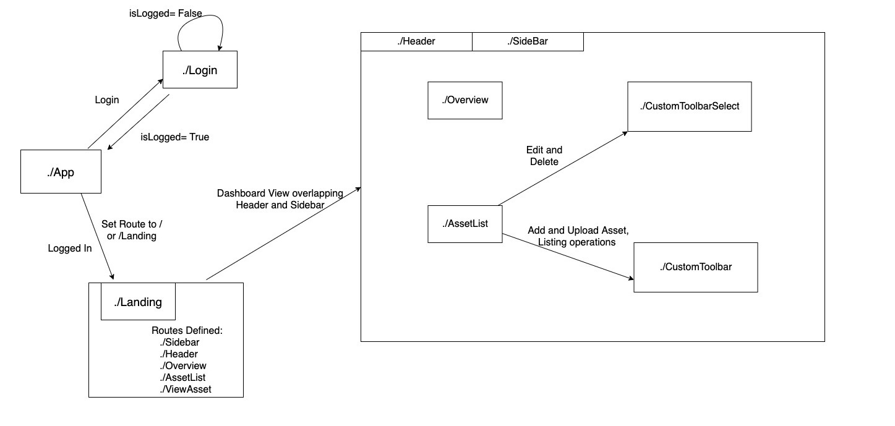
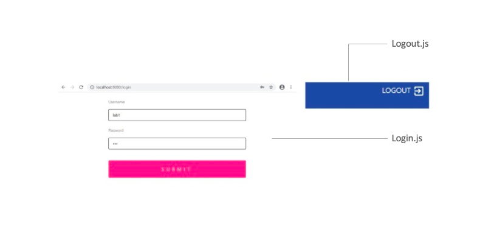
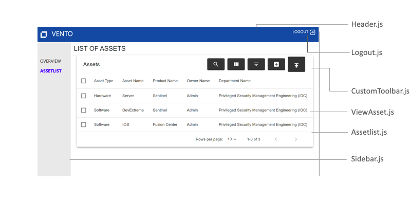
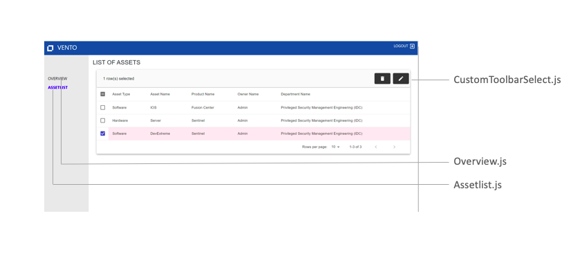
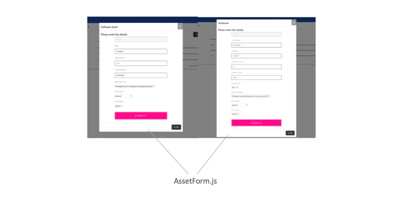

# Vento Client

The client side is built on [Reactjs](https://reactjs.org/).

### UI Layout
1. 	The Client side of Vento Inventory Management System begins with a login screen. The Existing users can Sign In.
2. 	It then takes the user to the main dashboard. On the Sidebar are two options; `Overview` and `AssetList`.
3. 	`Overview` gives a brief about the App.
4. 	`AssetList` lists out all the Hardware and Software assets on a table.
5. 	The user depending upon his permission upon login can Create an asset, Edit an asset, Delete asset(s) or also Upload the assets through a CSV.

### Control Flow

The control flow for the project vento's front end is as illustrated.

### Components- Mapping

- `Login.js` and `Logout.js`:

These are the basic components that provide the functionality of logging in and out of Vento.

- `Landing.js`:

This component is used to map all the components that are a part of project Vento. The `Header` is kept as a static content across pages and each page is mapped to the `Sidebar`, the component specific to it and the route that the page takes on the URL.
 
- `Assetlist.js`:

[MUI datatable for react](https://github.com/gregnb/mui-datatables) is used for the creation of an assets table. 

The operations supported in this table include global search, column-wise filtering and choosing the columns to be displayed. Additional operations provided as part of the toolbar like creation of assets and uploading asset information as CSV come under `CustomToolbar`.

On clicking any asset on the table, the `ViewAsset` component provides all other information pertaining to that particular asset to be viewed.
 

‘On row click’ features like deletion of assets(on selecting one or more rows) and editing an asset's information(on selecting strictly one row) are available in `CustomToolbarSelect`.

##### Creating/ Editing an asset:

[React modals](https://react-bootstrap.github.io/components/modal/) are used to serve as a dialog pop-up on asset create/edit. The `AssetForm` component provides the form with the required fields necessary for asset create/edit. A common form is used for both and based on the mode i.e, create or edit, the form content is changed.

